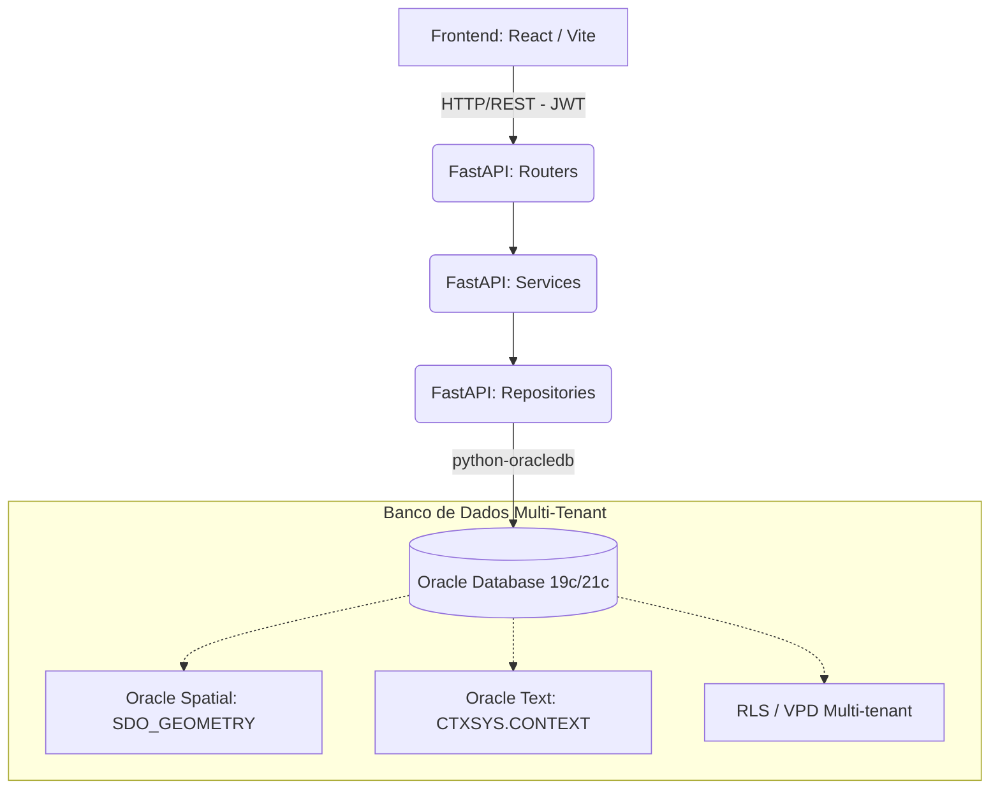
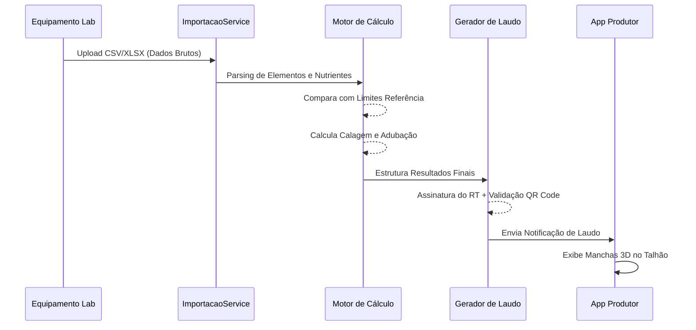

<div align="center">
  
  
  

  <h1 align="center">🌱 AgroGemini LIMS</h1>

  <p align="center">
    <strong>Sistema de Gerenciamento de Informações Laboratoriais para Fertilidade de Solo</strong><br>
    <em>Integrando laboratórios, produtores e consultores com inteligência e alta performance.</em>
  </p>

  <p align="center">
    
    
    
    
    
  </p>
</div>

<br/>

## 📋 Índice
- [🎯 Sobre o Projeto](#-sobre-o-projeto)
- [🔬 Base Científica e Agronômica](#-base-científica-e-agronômica)
- [⚙️ Arquitetura do Sistema](#️-arquitetura-do-sistema)
- [🔄 Fluxo de Dados](#-fluxo-de-dados)
- [🛠 Tecnologias](#-tecnologias)
- [👥 Perfis de Acesso](#-perfis-de-acesso)
- [🚀 Como Executar](#-como-executar)

---

## 🎯 Sobre o Projeto

O **AgroGemini** atua como uma plataforma integradora inteligente em toda a cadeia agronômica:

> **🧪 Laboratórios:** SaaS multi-tenant robusto para importação de dados brutos (CSV/XLSX), processamento de laudos, gestão de equipe e assinaturas.
> 
> **🧑‍🌾 Produtores:** Painel simplificado para visualizar o histórico de fazendas, interpretar laudos e receber recomendações precisas de calagem e adubação em "Digital Twins" 3D.
> 
> **👨‍🔬 Consultores:** Ferramentas avançadas para cruzamento de análises de solo com parâmetros ideais por cultura, bioma e extração.

---

## 🔬 Base Científica e Agronômica

O **Motor de Cálculo** é o coração da plataforma, construído rigorosamente sobre princípios agronômicos consolidados:

*   **🧪 Extração de Nutrientes:** Avaliação de níveis críticos de Macronutrientes (P, K, Ca, Mg, S), Micronutrientes e Matéria Orgânica.
*   **📊 Limites Dinâmicos:** A interpretação de níveis (Baixo, Médio, Alto) não é fixa. Ela se adapta cruzando: **Cultura**, **Bioma**, **Textura do Solo** e **Método de Extração**.
*   **🧮 Cálculo de Necessidades:** Geração de necessidade real de corretivos (tonelagem de calcário/adubo) baseada nos manuais oficiais de recomendação agronômica.
*   **🤖 Preparado para Machine Learning:** Arquitetura pronta para transição de regras determinísticas (fórmulas PL/SQL) para pipelines de recomendação avançados com *Oracle Machine Learning (OML4Py)*.

---

## ⚙️ Arquitetura do Sistema

O sistema foi estruturado seguindo o princípio de Separação de Responsabilidades (SoC), garantindo manutenibilidade e alta escalabilidade.



---

## 🔄 Fluxo de Dados

Ciclo de vida de uma amostra, desde a leitura no equipamento até a mão do produtor rural:



---

## 🛠 Tecnologias

Stack tecnológica definida para lidar com alta volumetria e exigências de isolamento e rastreabilidade:

| Camada | Stack Principal | Principais Funcionalidades |
| :--- | :--- | :--- |
| **Backend** | `Python 3` / `FastAPI` | Processamento assíncrono, validação Pydantic, Injeção de Dependências. |
| **Frontend** | `React` / `Vite` | Context API, CSS Vanilla ultra performático, Three.js para mapeamento 3D. |
| **Database** | `Oracle 19c/21c` | Isolamento (VPD), Particionamento (`INTERVAL MONTH`), Auditoria automática. |
| **Segurança** | `JWT Auth` / `CORS` | Triggers de rastreabilidade (INSERT/UPDATE/DELETE), Sessões seguras. |

---

## 👥 Perfis de Acesso

A plataforma conta com controle de acesso rigoroso por *Virtual Private Database* (VPD):

- 👑 **ADM (Administrador):** Gestão geral, controle global de tenants e planos SaaS.
- 🏢 **UP (Usuário Principal):** Gestor da unidade laboratorial (dono do tenant). Controla equipe e pagamentos.
- 🔬 **UC (Usuário Comum):** Técnico laboratorial ou químico que opera a plataforma, importa laudos e valida resultados.
- 🧑‍🌾 **UE (Usuário Externo):** Produtor rural. Possui interface restrita apenas aos resultados e fazendas sob sua gestão.

---

## 🚀 Como Executar

### Pré-requisitos
- Python 3.10+
- Node.js 18+ e npm
- Banco de Dados Oracle 19c ou 21c (disponível localmente ou nuvem)

<details>
<summary><b>1. Configurando o Backend</b></summary>

```bash
cd backend
python -m venv venv

# Ative o ambiente virtual
source venv/bin/activate  # (Linux/Mac)
# ou
venv\Scripts\activate     # (Windows)

pip install -r requirements.txt

# Iniciar o servidor de desenvolvimento
uvicorn app.main:app --host 0.0.0.0 --port 8000 --reload
```
</details>

<details>
<summary><b>2. Configurando o Frontend</b></summary>

```bash
cd frontend
npm install

# Iniciar aplicação React
npm run dev
```
</details>

<details>
<summary><b>3. Executando as Migrations</b></summary>

Os scripts de banco estão versionados na pasta `/db`.
Utilize sua ferramenta SQL preferida (ex: SQL Developer, DBeaver) para executar os arquivos. Para ambiente de demonstração, utilize o consolidado que inclui o *Seed* (dados de teste):

```sql
@db/agrogemini_oracle_migration_seed_v4_consolidada.sql
```
</details>

> 💡 **Para detalhes operacionais em ambiente produtivo**, consulte também o [GUIA_EXECUCAO.md](GUIA_EXECUCAO.md), e as diretrizes do seu SO: [README_WINDOWS.md](README_WINDOWS.md) ou [README_UBUNTU.md](README_UBUNTU.md).
